## drl4slicing

A simple yet comprehensive Network Slicing simulator integrated with a Deep Reinforcement Learning agent for a self-improving performance.

## Description

The provided code is intended to simulate the execution of a network slicing scenario based on a deep reinforcement learning (DRL) agent. The implementation of the code aims as much as possible to follow the interaction model of the DRL loop, which is presented as shown below.

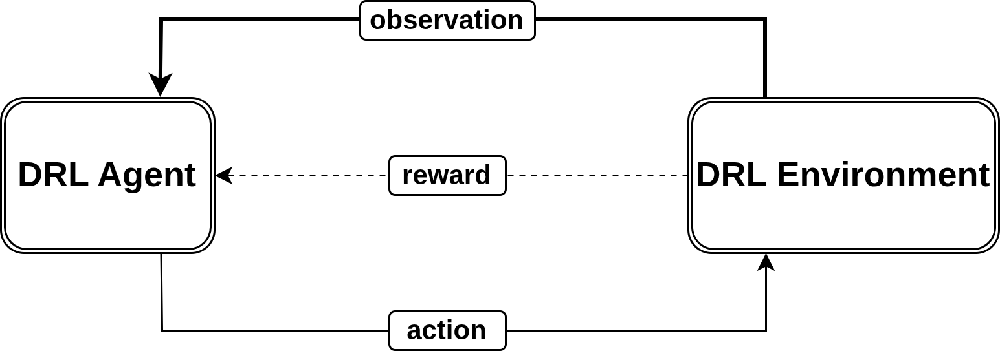</img>

Consequently, the code provides a number of classes, functions, and configuration files that allow for obtaining and/or defining five essential elements: the DRL environment, Observation, DRL agent, Action, and Reward function.

## Components presentation
### DRL environment

It is composed of the physical infrastructure (on which the slices will be placed) and, of course, the slices to be placed. Note that in this context, slices and NSPR (Network Slice Placement Request) are used interchangeably.
In the provided code, to instantiate the [environment](./src/drl4slicing/pipelines/utils/Environment.py), one must supply an instance of an InfrastructureManager and an NSPRGenerator.

#### NSPRGenerator

The [NSPRGenerator](./src/drl4slicing/pipelines/utils/NSPRGenerator.py) class is responsible for generating the slices to be placed on the network slicing infrastructure. It produces slice requests, each consisting of a certain number of VNFs (Virtual Network Functions) interconnected by VLs (Virtual Links). The figure below provides an overview.

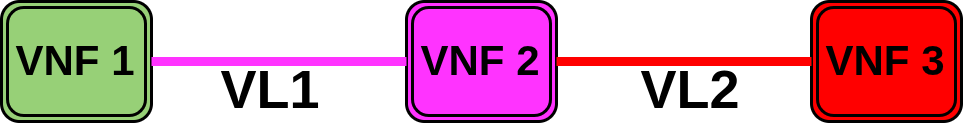</img>

#### InfrastructureManager

The [InfrastructureManager](./src/drl4slicing/pipelines/utils/InfrastructureManager.py) class also defines the infrastructure (see figure below), as well as several functions that enable its management.

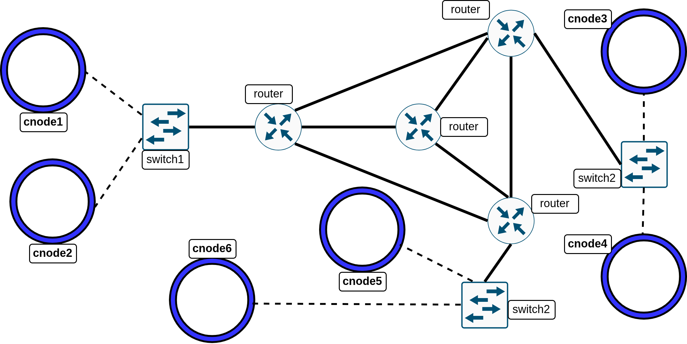</img>

The functions defined in this class make it possible, among other things, to:
* describe the remaining resources (CPU, RAM, and storage space) on the computing nodes (cnodes),
* describe the available bandwidth resources on the physical links directly connected to the cnodes,
* find a path with a minimum bandwidth requirement between two cnodes,
* place a VNF on a cnode
* update remaining resources on a cnode after placing a VNF, and so on.

### Observation

It can be seen as a snapshot of the environment’s state at a given time. It is implemented by the `describe_only_cnodes_and_vnf_requirements` function in [InfrastructureManager](./src/drl4slicing/pipelines/utils/InfrastructureManager.py) class and represented as follows:

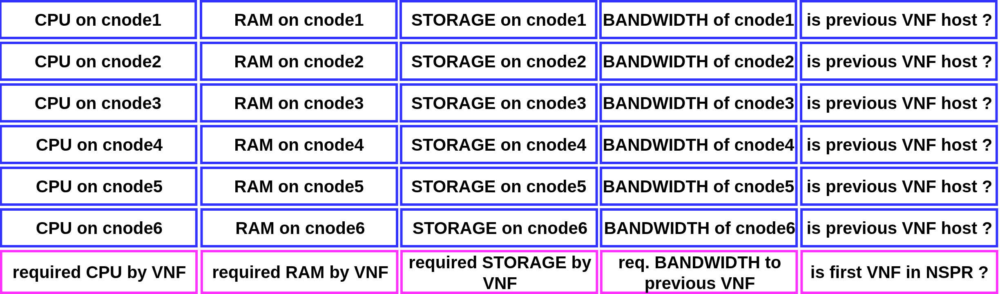</img>

It consists of a set of values that reflect the level of remaining resources in the infrastructure’s cnodes and the links directly connected to them. It also describes the resources required by the VNF currently being processed, as well as the bandwidth needed between it and the previous VNF. In addition, it includes boolean markers (`is previous VNF host` and `is first VNF in NSPR`) that indicate, respectively, which cnode hosts the previous VNF and whether the VNF currently being processed is the first in the slice to be placed. As a reminder, the placement of a slice here is performed iteratively, placing its VNFs one by one.

### DRL agent

It represents the intelligent “brain” responsible for observing (through the received Observations) and deciding which of the infrastructure’s cnodes would be most optimal for placing the current VNF. Note that in the provided code, optimality is defined simply as maximizing the number of slices successfully placed. The DRL agent has been implemented on top of the DDQN algorithm using [pfrl](https://pfrl.readthedocs.io), to which two additional modules have been coupled to ensure the robustness of the learned VNF placement policy as well as scalability.

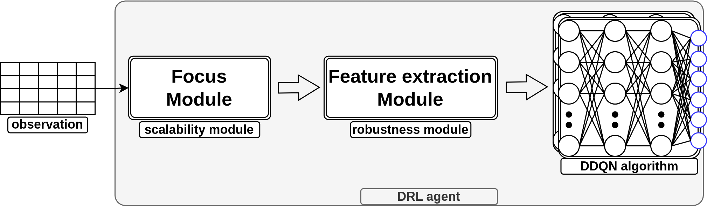</img>

#### Module for policy robustness

This [module](./src/drl4slicing/pipelines/utils/Model.py) enables the extraction of features from the received observation, instead of treating it as ready-to-learn data. In fact, this implementation was inspired by the feature extraction mechanism used in CNNs, but simply replaced the CNN layers with Transformer layers.

#### Module for scalability

To ensure the scalability of the DRL agent, the code includes a pruning [module](./src/drl4slicing/pipelines/utils/FocusModule.py) called `focus`, which filters the observation and retains only k cnodes deemed most relevant for placing the current VNF. This module can be enabled or disabled via the simulation parameter configuration file.

### Action

The action of the DRL agent consists of generating the index of the cnode on which the VNF currently being processed should be placed. Thus, the last layer of the agent’s neural network contains as many neurons as there are cnodes in the infrastructure. However, if the focus module is activated, this number is reduced to k (the k most relevant cnodes). The value of k can be configured in the simulation parameter configuration file.

### Reward function

The reward function implemented in this code encourages the DRL agent to place as many VNFs as possible while ensuring load balancing of the infrastructure’s cnode resources. It's implemented int the `try_placement` function in [InfrastructureManager](./src/drl4slicing/pipelines/utils/InfrastructureManager.py) class

### Policy update

The DRL agent’s neural networks must be updated as it interacts with its environment. This is what ensures the agent’s continuous performance improvement. The provided code uses the [LION optimizer](./src/drl4slicing/pipelines/utils/lion_pytorch.py) for training the agent’s neural networks.

## Simulation flow and other details

The simulation therefore begins with a slice to be placed and an infrastructure:

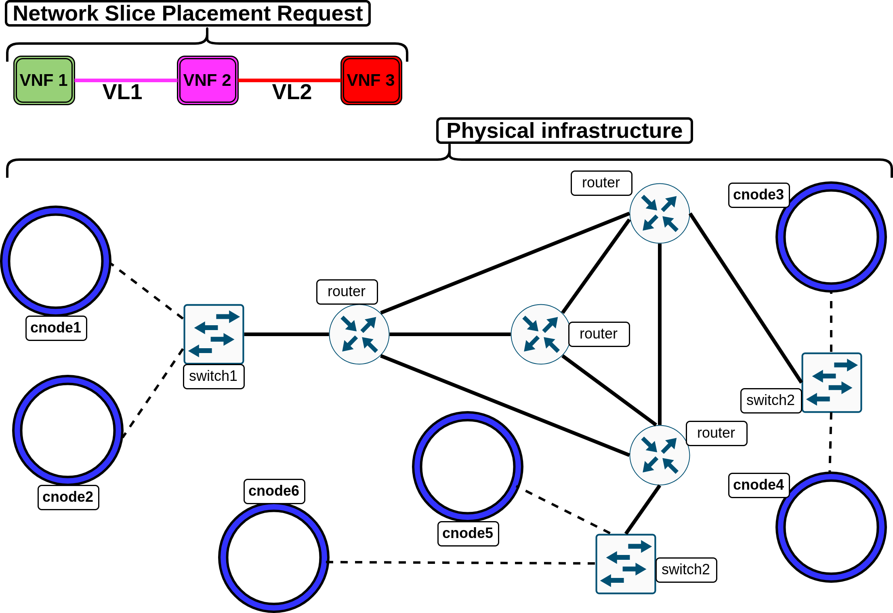</img>

The infrastructure, as well as the first VNF, are described in an observation that is sent to the DRL agent. Suppose the agent determines that `cnode1` is the most optimal choice for placing `VNF1`. The result is as follows:

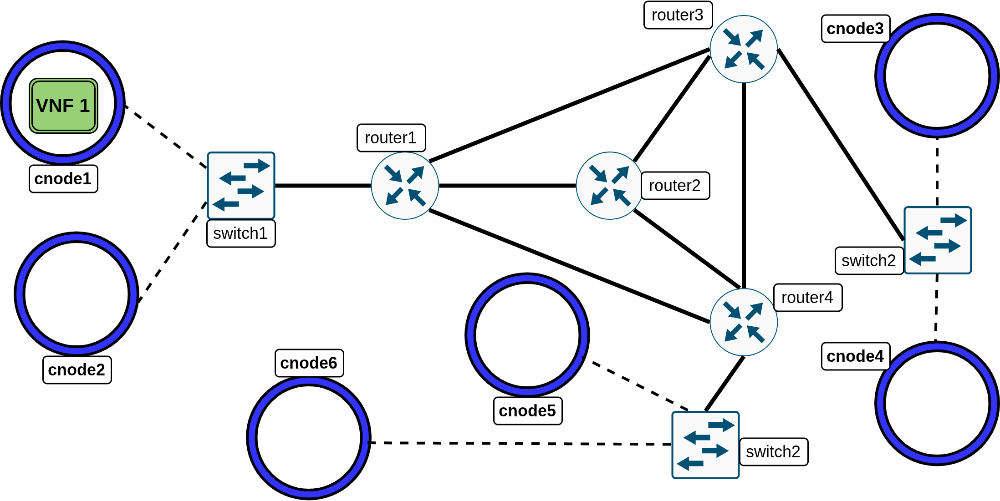</img>

Since `VNF1` is the first in the slice to be placed, there is no virtual link (VL) to be established between it and any preceding VNF. The resources required by `VNF2`, along with the remaining resources on the infrastructure, are sent to the DRL agent in a new observation along with the obtained reward for `VNF1`. Suppose the agent determines that `cnode3` is the most optimal choice for placing `VNF2`. The result is as follows:

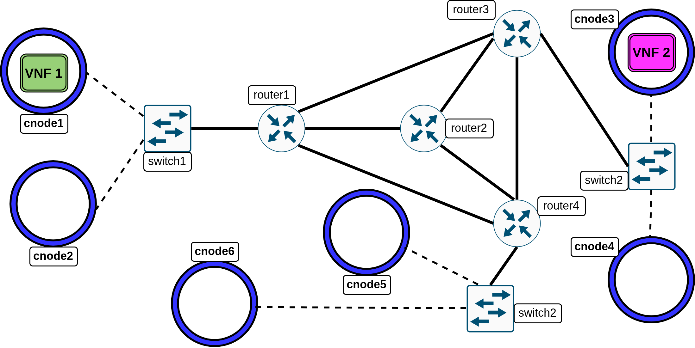</img>

A path satisfying the minimum bandwidth required by `VL1` is then computed using the `find_a_valid_path_between` function in the [InfrastructureManager](./src/drl4slicing/pipelines/utils/InfrastructureManager.py) class. The result is as follows:

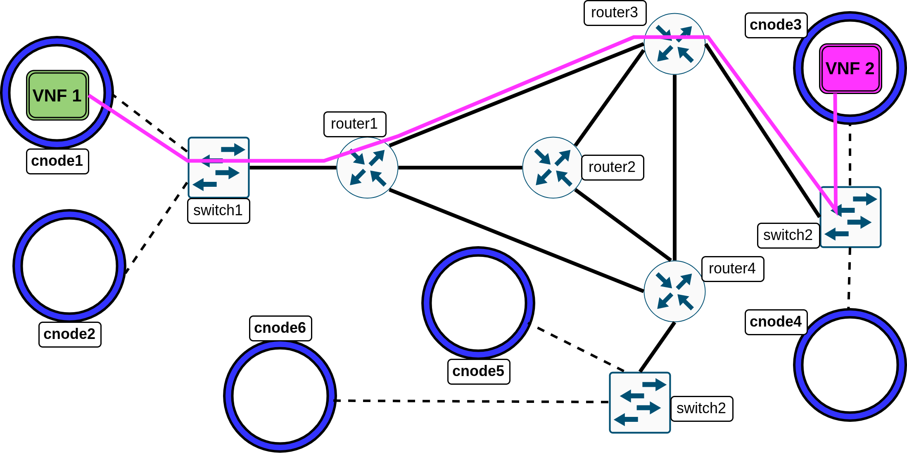</img>

The resources required by `VNF3`, along with the remaining resources on the infrastructure, are sent to the DRL agent in a new observation. Suppose the agent determines that `cnode5` is the most optimal choice for placing `VNF3`. The result is as follows:

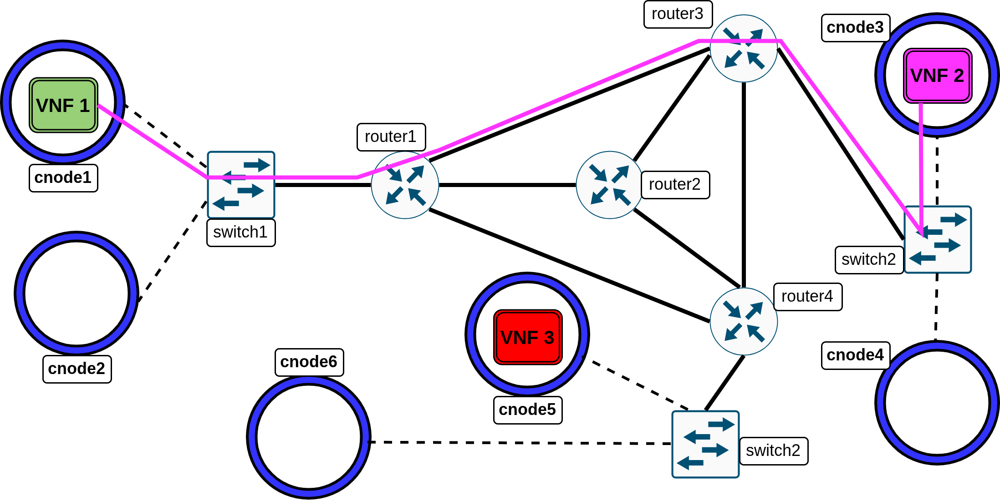</img>

The `find_a_valid_path_between` function of the InfrastructureManager class is again used to find a path that satisfies the minimum bandwidth required by `VL2`. The result is as follows:

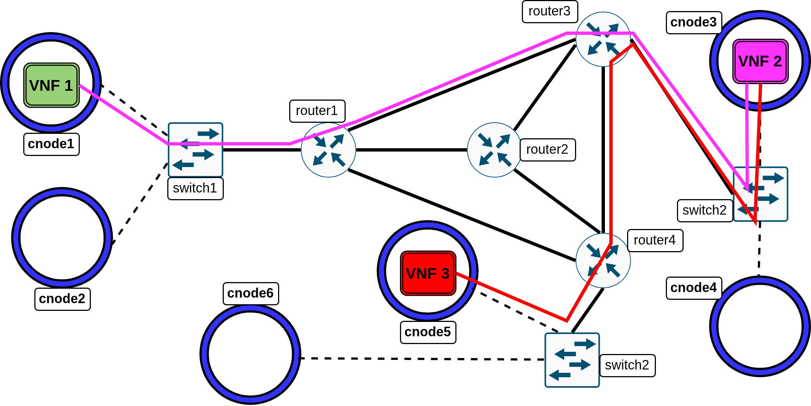</img>

Since the last VNF of the slice has been placed, the slice is considered successfully placed. The simulation then continues with the generation of a new slice to be placed, while keeping the infrastructure as is. All these interactions between the DRL agent and its environment constitute an episode. An episode ends when the agent fails to place the VNF currently being processed. In that case, a new episode begins with a reset of the infrastructure and its initial cnode resources. It should be noted that from one episode to the next, the DRL agent itself is not reset, as it must retain the knowledge acquired from previous episodes : this is what enables it to gradually improve over time. The number of slices placed in each episode is recorded in a .txt file (specified by the `save_perf_in` parameter in the configuration file). If the DRL agent is effectively learning and improving, plotting the values from this file should show a curve that starts low for a number of episodes, then rises progressively until reaching a plateau corresponding to the maximum number of slices that can be placed. Finally, note that the code relies on a second static evaluation environment to assess the agent’s performance at each step. This ensures that the number of placed slices is always evaluated under the same conditions.

## Installation

The provided code is organized using the Kedro framework. Readers can visit the [Kedro website](https://docs.kedro.org) to learn more.
To use the code, one must first install the dependencies listed in the requirements.txt file.

```
pip install -r requirements.txt
```

## Launching a simulation

Once the simulation configuration parameters have been defined in the [agent](./conf/base/parameters_focus_trf_d_dqn.yml) and [environment](./conf/base/parameters.yml) configuration files, run the following Kedro command:

```
kedro run --pipeline focus_trf_d_dqn
```
By default, the simulation is launched on CPU. One can change the `gpu` parameter (in [configuration file](./conf/base/parameters_focus_trf_d_dqn.yml)) from -1 to 0 to enable a faster GPU-based simulation.

## Adding a custom infrastructure

To add a new slicing infrastructure to the simulation, follow these steps:

### Step 1

Implement the new infrastructure in the InfrastructureManager class.
The only requirements are that the infrastructure must be implemented using [NetworkX](https://networkx.org/), and that the computing nodes must be named using the format "cnodeX", where X is an integer.
Therefore, if the new infrastructure includes 20 cnodes, the computing nodes' names must go from "cnode1" to "cnode20".
It is recommended to take inspiration on the implementation of the existing infrastructure inside [InfrastructureManager](./src/drl4slicing/pipelines/utils/InfrastructureManager.py) class as an example.

### Step 2

Register the new infrastructure in the reset function of the [InfrastructureManager](./src/drl4slicing/pipelines/utils/InfrastructureManager.py) class.
Again, one can follow the approach used to register the existing infrastructure.

### Step 3

Specify the new infrastructure in the [configuration file](./conf/base/parameters.yml) (`choice`, `expected_cnodes`, `expected_switches` and `expected_routers` parameters).

## Cite this repository

The provided code is an extension of the code that was used to write the article below.
Please cite the following work if you use the code of this repository.

```bibtex
@inproceedings{Boni2025afeda,
    title={AFEDA: Enhancing Network Slices Acceptance Ratio with Transformer-based Feature Extraction}, 
    author={Abdel Kader Chabi Sika Boni and Hassan Hassan and Khalil Drira},
    booktitle={2025 International Conference on Artificial Intelligence, Computer, Data Sciences and Applications (ACDSA)}, 
    year={2025},
    doi={10.1109/ACDSA65407.2025.11165997}
}
```